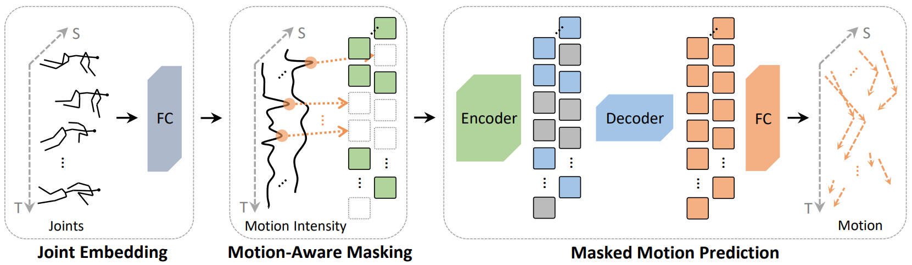

# Masked Motion Predictors are Strong 3D Action Representation Learners
Yunyao Mao, Jiajun Deng, Wengang Zhou, Yao Fang, Wanli Ouyang, Houqiang Li

### Accepted by **ICCV 2023**. [[Paper Link]](https://arxiv.org/pdf/2308.07092.pdf)

This repository includes Python (PyTorch) implementation of the MAMP.



# Abstract
In 3D human action recognition, limited supervised data makes it challenging to fully tap into the modeling potential of powerful networks such as transformers. As a result, researchers have been actively investigating effective self-supervised pre-training strategies. In this work, we show that instead of following the prevalent pretext task to perform masked self-component reconstruction in human joints, explicit contextual motion modeling is key to the success of learning effective feature representation for 3D action recognition. Formally, we propose the Masked Motion Prediction (MAMP) framework. To be specific, the proposed MAMP takes as input the masked spatio-temporal skeleton sequence and predicts the corresponding temporal motion of the masked human joints. Considering the high temporal redundancy of the skeleton sequence, in our MAMP, the motion information also acts as an empirical semantic richness prior that guide the masking process, promoting better attention to semantically rich temporal regions. Extensive experiments on NTU-60, NTU-120, and PKU-MMD datasets show that the proposed MAMP pre-training substantially improves the performance of the adopted vanilla transformer, achieving state-of-the-art results without bells and whistles.

# Requirements

```bash
python==3.8.13
torch==1.8.1+cu111
torchvision==0.9.1+cu111
tensorboard==2.9.0
timm==0.3.2
scikit-learn==1.1.1
tqdm==4.64.0
numpy==1.22.4
```

# Data Preparation

### Download datasets.
#### NTU RGB+D 60 and 120
1. Request dataset here: https://rose1.ntu.edu.sg/dataset/actionRecognition
2. Download the skeleton-only datasets:
   1. `nturgbd_skeletons_s001_to_s017.zip` (NTU RGB+D 60)
   2. `nturgbd_skeletons_s018_to_s032.zip` (NTU RGB+D 120)
   3. Extract above files to `./data/nturgbd_raw`

#### PKU-MMD Phase I and Phase II
1. Request dataset here: http://39.96.165.147/Projects/PKUMMD/PKU-MMD.html
2. Download the skeleton data, label data, and the split files:
   1. `Skeleton.7z` + `Label_PKUMMD.7z` + `cross_subject.txt` + `cross_view.txt` (Phase I)
   2. `Skeleton_v2.7z` + `Label_PKUMMD_v2.7z` + `cross_subject_v2.txt` + `cross_view_v2.txt` (Phase II)
   3. Extract above files to `./data/pku_raw`

### Data Processing

#### Directory Structure

Put downloaded data into the following directory structure:

```
- data/
  - ntu/
  - ntu120/
  - nturgbd_raw/
    - nturgb+d_skeletons/     # from `nturgbd_skeletons_s001_to_s017.zip`
      ...
    - nturgb+d_skeletons120/  # from `nturgbd_skeletons_s018_to_s032.zip`
      ...
  - pku_v1/
  - pku_v2/
  - pku_raw/
    - v1/
      - label/
      - skeleton/
      - cross_subject.txt
      - cross_view.txt
    - v2/
      - label/
      - skeleton/
      - cross_subject_v2.txt
      - cross_view_v2.txt
```

#### Generating Data

- Generate NTU RGB+D 60 or NTU RGB+D 120 dataset:
```
cd ./data/ntu # or cd ./data/ntu120
# Get skeleton of each performer
python get_raw_skes_data.py
# Remove the bad skeleton 
python get_raw_denoised_data.py
# Transform the skeleton to the center of the first frame
python seq_transformation.py
```
- Generate PKU-MMD Phase I or PKU-MMD Phase II dataset:
```
cd ./data/pku_v1 # or cd ./data/pku_v2
python pku_gendata.py
```

# Training and Testing
Please refer to the bash scripts. Note that we are verifying the correctness of these scripts. If you find any problems with the code, please feel free to open an issue or contact us by sending an email to myy2016[AT]mail.ustc.edu.cn.

### Pretrained Models
You can find the latest pretrained models [here](https://rec.ustc.edu.cn/share/64bde560-5939-11ee-bf1f-5fbb082a1db4).
| Protocols | NTU-60 X-sub | NTU-60 X-view | NTU-120 X-sub | NTU-120 X-set |
|:---------:|:------------:|:-------------:|:-------------:|:-------------:|
|  Linear   |     85.0     |      89.0     |      78.1     |      79.5     |
| Finetune  |     93.0     |      97.5     |      89.8     |      91.5     |


# Citation
If you find this work useful for your research, please consider citing our work:
```
@inproceedings{mao2023mamp,
  title={Masked Motion Predictors are Strong 3D Action Representation Learners},
  author={Mao, Yunyao and Deng, Jiajun and Zhou, Wengang and Fang, Yao and Ouyang, Wanli and Li, Houqiang},
  booktitle={Proceedings of the IEEE/CVF International Conference on Computer Vision (ICCV)},
  year={2023}
}
```

# Acknowledgment
The framework of our code is based on [mae](https://github.com/facebookresearch/mae).
